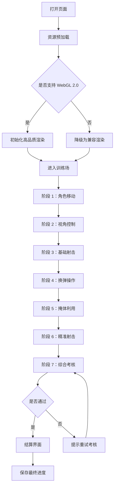

# 产品需求文档：无畏契约风格第三人称射击新手引导场景

## 1. 产品概述

基于 Web 平台（Three.js + React + TypeScript）构建的第三人称射击（TPS）新手引导场景，视觉风格严格贴合《无畏契约（Valorant）》的战术美学。产品面向首次接触战术射击游戏的玩家，通过 7 个循序渐进的交互阶段，教授移动、瞄准、射击、换弹、掩体、精准打击与综合考核等核心操作。

- **核心目标**：在浏览器中提供 60 FPS 以上、低延迟、高反馈的新手训练体验。
- **目标用户**：战术射击游戏新手、需要快速熟悉 WASD + 鼠标操作的玩家。
- **平台**：现代浏览器（Chrome / Firefox / Safari 最新版），桌面端优先。

## 2. 核心功能

### 2.1 用户角色

| 角色 | 进入方式 | 核心权限 |
|------|----------|----------|
| 训练玩家 | 直接打开页面 | 操控角色、完成引导、查看进度 |

### 2.2 功能模块

1. **训练场入口**：加载页、资源预加载、性能自适应提示。
2. **3D 训练场景**：封闭式战术训练区域，包含掩体、训练目标、战术装备陈列。
3. **角色控制系统**：WASD 移动、空格跳跃、鼠标瞄准、滚轮缩放、V 键切换第一/第三人称。
4. **武器与射击系统**：左键射击、R 换弹、弹药计数、弹道与命中判定。
5. **7 阶段新手引导**：分步骤任务提示、进度保存、断点续教、智能提示调整。
6. **UI/HUD 系统**：战术风格半透明面板、准星、血条/弹药、任务指引、伤害数字。
7. **反馈系统**：命中弹痕、粒子特效、音效、浏览器震动 API（如支持）。
8. **AI 目标系统**：静止靶、移动靶、受击反馈、行为逻辑。
9. **性能监控（开发模式）**：FPS、内存、Draw Call 概览。

### 2.3 页面/模块详情

| 页面/模块 | 子模块 | 功能描述 |
|-----------|--------|----------|
| 加载页 | 资源预加载 | 加载纹理、音效、3D 资源，显示进度条与提示 |
| 训练场 | 3D 场景渲染 | 战术建筑、光照、PBR 材质、环境光遮蔽 |
| HUD | 状态面板 | 弹药、生命值、任务目标、小地图、准星 |
| 引导层 | 步骤提示 | 当前阶段说明、操作高亮、动态指引 |
| 结算页 | 考核结果 | 用时、命中率、得分、重试/继续 |

## 3. 核心流程

玩家进入页面后，首先进入加载与初始化阶段。资源就绪后进入训练场，系统按顺序解锁 7 个教学阶段。每个阶段都有明确的任务目标与完成条件，完成后自动保存进度并进入下一阶段。第 7 阶段为综合考核，完成后显示结算界面。

## 4. 用户界面设计

### 4.1 设计风格

- **主色调**：深灰（#1A1D24）作为环境底色，蓝紫（#7C3AED / #4F46E5）作为信息强调色，亮橙（#FF5722 / #FF9100）作为交互高亮与伤害反馈色。
- **辅助色**：战术白（#F3F4F6）、警示红（#EF4444）、成功绿（#22C55E）。
- **按钮风格**：锐角、细边框、半透明面板、内发光 hover 效果。
- **字体**：
  - 标题："Rajdhani" 或 "Orbitron"（科技感、硬朗）
  - 正文："Noto Sans SC" / system-ui
- **布局**：全屏 3D 画布，HUD 元素以绝对定位覆盖其上，边缘留白 16–24px。
- **图标风格**：线性、极简、Lucide React 图标。

### 4.2 页面设计概述

| 页面 | 模块 | UI 元素 |
|------|------|---------|
| 加载页 | 加载动画 | 进度条、战术 Logo、提示文字 |
| 训练场 | HUD | 准星、弹药计数、任务面板、小地图、血条 |
| 训练场 | 引导提示 | 顶部任务条、底部操作提示、按键高亮 |
| 结算页 | 结果卡片 | 命中率、用时、得分、星级、按钮 |

### 4.3 响应式与适配

- **桌面优先**：默认适配 1920×1080 及以上分辨率。
- **全屏锁定**：建议玩家按 F11 进入全屏以获得最佳体验。
- **性能自适应**：根据 FPS 动态调整阴影质量、粒子数量、后处理强度。

### 4.4 3D 场景指导

- **环境氛围**：封闭式训练基地，冷色调金属墙面，局部橙色警示灯，营造《无畏契约》式战术氛围。
- **光照设置**：
  - 主光源：方向光（模拟顶部冷白灯光），强度 1.2，开启阴影。
  - 环境光：半球光，低强度补充暗部。
  - 特色光源：橙色点光源点缀通道与掩体边缘，营造层次感。
- **相机**：第三人称跟随相机，支持鼠标控制俯仰/偏航，平滑插值跟随，可切换 FOV 与视角模式。
- **构图**：角色位于画面下方 1/3，前方留出足够视野观察训练目标与掩体。
- **后处理**：
  - Bloom（辉光）用于武器开火与橙色警示灯。
  - 轻微色调映射（ACESFilmic）提升对比。
  - 可选 Vignette（暗角）增强电影感。
- **性能预算**：目标场景 Draw Call < 200，三角面数 < 80k，内存占用 < 512MB。

## 5. 非功能性需求

- **性能**：主流现代浏览器稳定 60 FPS，内存占用不超过 512MB。
- **兼容性**：Chrome 120+、Firefox 120+、Safari 17+。
- **可维护性**：模块化 TypeScript 代码，按场景、角色、武器、UI、AI 分离。
- **可扩展性**：便于新增武器、敌人类型、教学阶段。
- **错误处理**：WebGL 不支持时给出友好降级提示；资源加载失败时允许重试。
