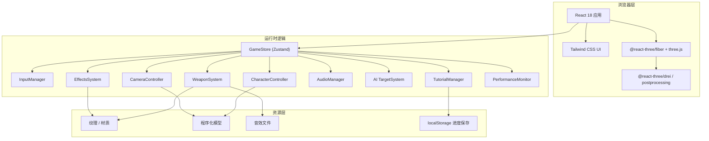

# 技术架构文档：无畏契约风格 TPS 新手引导场景

## 1. 架构设计



## 2. 技术选型

| 层级 | 技术 | 版本/说明 |
|------|------|-----------|
| 前端框架 | React | 18.x |
| 构建工具 | Vite | 5.x / 6.x |
| 语言 | TypeScript | 5.x，严格模式 |
| 样式 | Tailwind CSS | 3.x |
| 状态管理 | Zustand | 4.x |
| 3D 渲染 | three.js | r160+ |
| React 3D 绑定 | @react-three/fiber | 8.x |
| 3D 辅助 | @react-three/drei | 9.x |
| 后处理 | @react-three/postprocessing | 2.x |
| 图标 | lucide-react | 最新 |
| 音效 | Web Audio API / howler | howler 2.x（可选） |
| 物理/碰撞 | 原生 three.js Raycaster + 自定义 AABB | 避免引入重型物理引擎 |

## 3. 路由定义

本项目为单页应用（SPA），主要路由如下：

| 路由 | 用途 |
|------|------|
| / | 加载页 + 训练场（主入口） |
| /result | 训练考核结算页（可选，作为覆盖层实现） |

> 实际实现中优先使用全屏覆盖层切换，减少路由复杂度。

## 4. 项目目录结构

```
游戏kimi/
├── .code/documents/           # PRD、技术架构文档
├── public/
│   ├── audio/                # 枪声、脚步声、命中音等
│   └── textures/             # 墙面、地面、金属等纹理
├── src/
│   ├── components/
│   │   ├── ui/               # HUD、引导面板、准星
│   │   └── three/            # 3D 场景相关组件
│   ├── hooks/                # 自定义 React Hooks
│   ├── stores/
│   │   └── gameStore.ts      # Zustand 全局状态
│   ├── systems/
│   │   ├── characterController.ts
│   │   ├── cameraController.ts
│   │   ├── weaponSystem.ts
│   │   ├── inputManager.ts
│   │   ├── audioManager.ts
│   │   ├── effectsSystem.ts
│   │   ├── targetSystem.ts
│   │   ├── tutorialManager.ts
│   │   └── performanceMonitor.ts
│   ├── scenes/
│   │   └── TrainingGround.tsx
│   ├── utils/
│   │   ├── constants.ts
│   │   ├── math.ts
│   │   └── localStorage.ts
│   ├── styles/
│   │   └── index.css
│   ├── types/
│   │   └── index.ts
│   ├── App.tsx
│   └── main.tsx
├── index.html
├── package.json
├── tailwind.config.js
├── tsconfig.json
└── vite.config.ts
```

## 5. 核心模块说明

### 5.1 GameStore（Zustand）

集中管理游戏状态：
- `playerState`: 位置、速度、生命值、弹药、是否在换弹、是否跳跃。
- `cameraState`: 视角模式（TPS/FPS）、距离、俯仰角、偏航角。
- `tutorialState`: 当前阶段、阶段完成标记、智能提示频率、总用时。
- `combatState`: 命中次数、射击次数、伤害数字列表。
- `settings`: 音量、画质等级、是否启用震动。
- `performance`: FPS、Draw Call、内存估算。

### 5.2 InputManager

统一监听键盘与鼠标事件：
- WASD 映射到移动方向向量。
- 空格触发跳跃。
- 鼠标移动映射到视角旋转。
- 左键射击、R 换弹、V 切换视角、滚轮缩放。
- Pointer Lock 管理：点击画布后锁定鼠标。

### 5.3 CharacterController

- 每帧读取 InputManager 的方向输入，计算目标速度。
- 应用加速度/减速度平滑移动，模拟惯性。
- 与场景 AABB 进行碰撞检测，防止穿墙。
- 跳跃逻辑：地面检测 + 垂直速度模拟重力。
- 角色模型朝向：根据相机方向平滑旋转。

### 5.4 CameraController

- 第三人称：球形坐标计算相机位置，跟随角色并带平滑延迟。
- 碰撞规避：从角色头部向相机发射 Raycaster，命中障碍物时拉近相机。
- 第一人称：相机位于角色头部，隐藏/缩放角色模型。
- 视角限制：俯仰角限制在 -80° ~ +60°。

### 5.5 WeaponSystem

- 管理武器状态：当前弹药、弹匣容量、射速、换弹时间、是否正在换弹。
- 射击：从屏幕中心或武器枪口发射 Raycaster，计算命中点。
- 命中反馈：调用 EffectsSystem 生成弹痕与火花，AudioManager 播放音效。
- 换弹：触发换弹动画与音效，恢复弹药。

### 5.6 TargetSystem（AI 目标）

- 静止靶：固定位置，受击时播放命中动画与音效。
- 移动靶：沿固定路径巡逻，速度可调，受击时短暂停顿。
- 命中判定：基于 Raycaster 与目标包围盒/网格检测。
- 受击反馈：显示伤害数字、材质闪烁、播放命中音效。

### 5.7 EffectsSystem

- 弹痕贴花：在命中表面生成几何体贴花，限时淡出。
- 开火闪光：点光源瞬间亮起 + 粒子爆发。
- 击中粒子：根据命中材质产生不同颜色火花。
- 环境粒子：可选的浮尘/烟雾粒子增强氛围。

### 5.8 AudioManager

- 使用 Web Audio API 或 howler 管理音效。
- 支持的音效：脚步循环、枪声、换弹声、命中金属/布料/塑料声、UI 提示音。
- 空间音效：根据距离调整音量（可选简化实现）。

### 5.9 TutorialManager

- 定义 7 个阶段的进入条件、完成条件、提示文案。
- 监听玩家操作事件，判断阶段进度。
- 断点续教：将当前阶段与关键数据写入 localStorage。
- 智能提示：根据玩家连续失败/空闲时间动态调整提示频率。

### 5.10 PerformanceMonitor

- 使用 `requestAnimationFrame` 计算 FPS。
- 估算内存：通过 `performance.memory`（Chrome）。
- 动态画质调整：FPS 持续低于阈值时降低阴影分辨率、粒子数量、后处理强度。

## 6. 数据模型

### 6.1 关键 TypeScript 类型

```typescript
interface PlayerState {
  position: Vector3;
  velocity: Vector3;
  health: number;
  ammo: number;
  magazineSize: number;
  isReloading: boolean;
  isJumping: boolean;
  isGrounded: boolean;
}

interface CameraState {
  mode: 'tps' | 'fps';
  distance: number;
  pitch: number;
  yaw: number;
  targetPosition: Vector3;
}

interface TutorialStage {
  id: number;
  title: string;
  description: string;
  objective: string;
  completed: boolean;
  hintFrequency: number;
}

interface Target {
  id: string;
  type: 'static' | 'moving';
  position: Vector3;
  health: number;
  maxHealth: number;
  path?: Vector3[];
  speed?: number;
}
```

### 6.2 localStorage 数据结构

```typescript
interface SaveData {
  currentStage: number;
  stagesCompleted: boolean[];
  bestScore: number;
  lastPlayedAt: string;
}
```

## 7. 性能优化策略

1. **资源分级加载**：优先加载角色、武器、训练场核心资源；音效按需加载。
2. **LOD**：目标模型根据距离切换几何体精度。
3. **视锥体剔除**：使用 three.js 默认 frustum culling。
4. **遮挡剔除**：在静态训练场中手动标记大型遮挡体，减少不必要绘制。
5. **纹理压缩**：使用 WebP/PNG 压缩纹理，合并为图集减少 draw call。
6. **合并静态网格**：将不可破坏的墙面、地面合并为单一 BufferGeometry。
7. **对象池**：弹痕、弹壳、伤害数字使用对象池复用。
8. **帧率自适应**：根据 FPS 动态调整渲染分辨率与后处理。
9. **WebGL 2.0**：启用以支持更高效的纹理与实例化渲染。
10. **动画优化**：骨骼动画使用 GPU 蒙皮，限制每帧更新骨骼数量。

## 8. 部署与运行

- **开发**：`npm run dev` 或 `pnpm dev` 启动 Vite 开发服务器。
- **构建**：`npm run build` 生成生产包。
- **预览**：`npm run preview` 本地预览生产包。
- **部署**：将 `dist/` 目录部署至任意静态托管服务（Vercel、Netlify、GitHub Pages 等）。

## 9. 浏览器兼容性

| 浏览器 | 最低版本 | 备注 |
|--------|----------|------|
| Chrome | 120 | 完全支持 WebGL 2.0 与所有特性 |
| Firefox | 120 | 完全支持 |
| Safari | 17 | 支持 WebGL 2.0，部分后处理需降级 |

对于不支持 WebGL 2.0 的浏览器，提供简化版渲染路径与友好提示。
