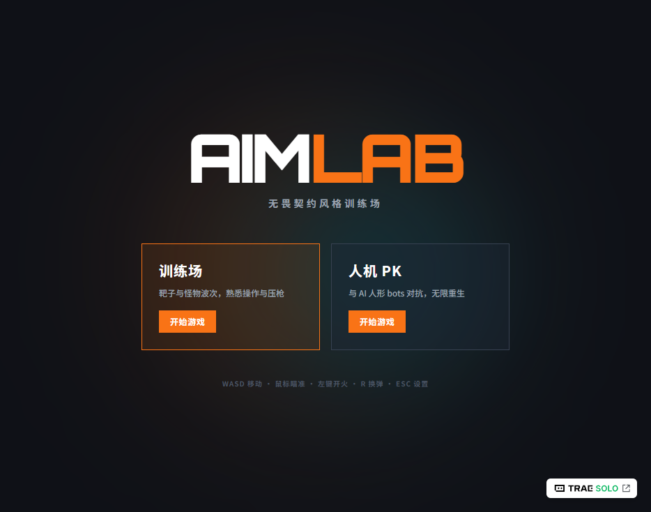
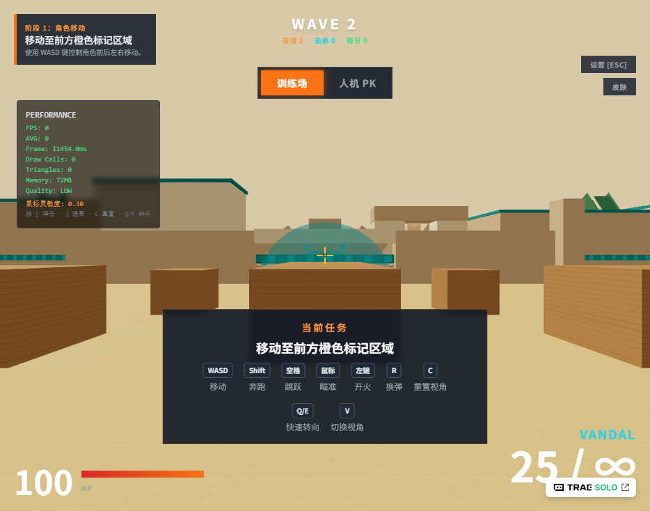
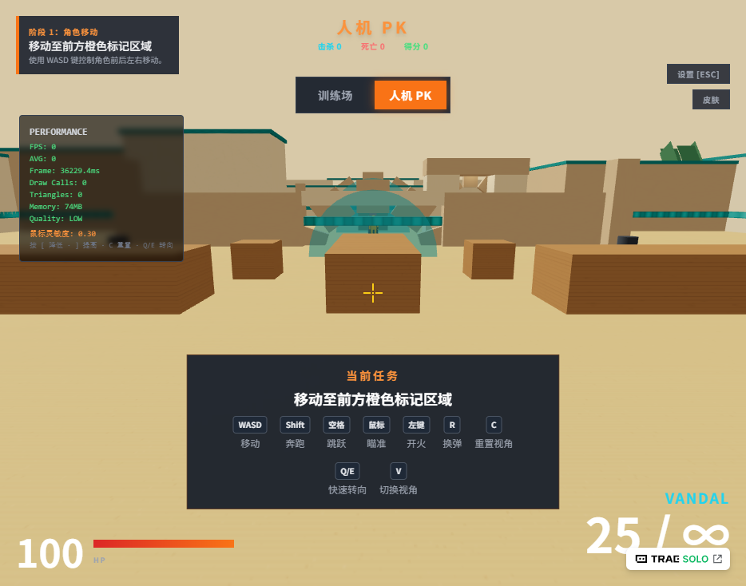
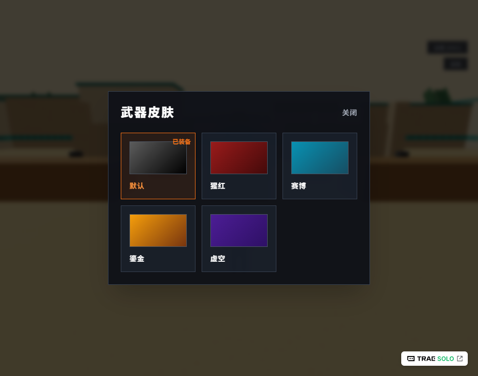

# AIM LAB — 无畏契约风格 FPS/TPS 训练场

<p align="center">
  
</p>

<p align="center">
  <b>在浏览器里就能玩的轻量级射击训练场</b>
</p>

<p align="center">
  <a href="#-在线体验">在线体验</a> •
  <a href="#-核心特性">核心特性</a> •
  <a href="#-游戏截图">游戏截图</a> •
  <a href="#-快速开始">快速开始</a> •
  <a href="#-技术栈">技术栈</a>
</p>

---

## 这是什么？

**AIM LAB** 是一款基于 Web 技术构建的射击训练小游戏，视觉与操作手感参考《无畏契约（Valorant）》。无需下载、无需安装，打开浏览器即可进入训练场：

- 在 **训练场模式** 中完成 7 个循序渐进的教学关卡，熟悉移动、瞄准、压枪与掩体利用。
- 在 **人机 PK 模式** 中与 AI 人形 Bot 正面交锋，爆头一枪带走，身体 40 伤害，无限弹药、无限重生。
- 解锁 **武器皮肤**，把 AK 换成你喜欢的配色。

> 如果你在学习 React / Three.js / 游戏开发，这也是一个完整可运行的开源示例：状态管理、3D 渲染、碰撞检测、AI 寻路、音效系统一应俱全。

---

## 游戏截图

### 主菜单与模式选择


### 训练场 · FPS 第一人称射击



### 人机 PK · 与人形 AI Bot 对抗



### 武器皮肤系统



---

## 核心特性

| 特性 | 说明 |
|------|------|
| **双模式游玩** | 训练场（7 阶段教学）+ 人机 PK（AI 死亡竞赛） |
| **人形 AI Bot** | 具有头部、躯干、四肢的独立命中判定 |
| **爆头机制** | 命中头部一枪毙命，身体命中 40 伤害 |
| **无限弹药** | 专注于瞄准与身法，无需担心弹匣 |
| **实体地图碰撞** | 墙面、掩体、障碍物均不可穿透 |
| **性能优化** | 空间网格（Spatial Grid）加速碰撞检测，告别卡顿 |
| **FPS/TPS 切换** | 按 `V` 键随时切换第一/第三人称 |
| **武器皮肤** | 默认 / 猩红 / 赛博 / 鎏金 / 虚空 五款配色 |
| **程序化音效** | Web Audio API 合成枪声、脚步声、命中反馈，零外部音频资源 |
| **自适应画质** | FPS 过低时自动降低特效与阴影质量 |

---

## 快速开始

### 在线体验

> 部署后补充地址，例如：
> `https://xiaoyugegeh.github.io/FPS-Mini-Game/`

### 本地运行

```bash
# 克隆项目
git clone git@github.com:xiaoyugegeh/FPS-Mini-Game.git
cd FPS-Mini-Game

# 安装依赖
npm install

# 启动开发服务器
npm run dev
```

开发服务器默认运行在 http://localhost:5173/

### 生产构建

```bash
# 构建生产包
npm run build

# 本地预览生产包
npm run preview
```

构建产物位于 `dist/` 目录，可部署至任意静态托管服务（Vercel、Netlify、GitHub Pages、Nginx 等）。

---

## 操作说明

| 按键 | 功能 |
|------|------|
| W / A / S / D | 前后左右移动 |
| Shift（按住） | 加速奔跑 |
| 空格 | 跳跃 |
| 鼠标移动 | 控制视角 |
| 鼠标左键 | 开火 |
| 鼠标滚轮 | 调整第三人称相机距离 |
| R | 换弹 |
| V | 切换第一/第三人称 |
| Q / E | 快速左右转向 |
| C | 重置视角 |
| [ / ] | 降低 / 提高鼠标灵敏度 |
| ESC | 打开设置 / 释放鼠标 |

---

## 7 个教学阶段

1. **角色移动**：使用 WASD 移动至橙色标记区域。
2. **视角控制**：移动鼠标将准星对准蓝色目标并保持 2 秒。
3. **基础射击**：点击左键击毁 3 个红色固定靶。
4. **换弹操作**：按 R 换弹并继续击毁目标。
5. **掩体利用**：穿越掩体区域到达终点。
6. **精准射击**：连续命中移动靶 5 次。
7. **综合考核**：60 秒内击毁所有考核目标。

---

## 技术栈

- **前端框架**：React 18 + TypeScript 5
- **构建工具**：Vite 6
- **样式方案**：Tailwind CSS 3
- **状态管理**：Zustand 5
- **3D 渲染**：three.js + @react-three/fiber 8 + @react-three/drei 9
- **音效**：Web Audio API（程序化合成，无需外部资源）

---

## 文件组织结构

```
游戏kimi/
├── .code/documents/               # PRD 与 技术架构文档
├── public/                       # 静态资源
├── screenshots/                  # 游戏截图（README 使用）
├── src/
│   ├── components/               # UI 与 3D 组件
│   │   ├── ui/                   # UI 组件
│   │   ├── CharacterModel.tsx    # 玩家角色模型
│   │   ├── MonsterView.tsx       # 人形 Bot 模型
│   │   └── WeaponView.tsx        # 武器模型
│   ├── scenes/
│   │   └── TrainingGround.tsx    # 3D 训练场景
│   ├── stores/
│   │   └── gameStore.ts          # Zustand 全局状态
│   ├── systems/                  # 游戏核心系统
│   │   ├── audioManager.ts       # 音频与震动反馈
│   │   ├── cameraController.ts   # 第三人称/第一人称相机
│   │   ├── characterController.ts# 角色移动、跳跃、碰撞
│   │   ├── effectsSystem.ts      # 弹痕、粒子特效
│   │   ├── inputManager.ts       # 键盘鼠标输入
│   │   ├── monsterSystem.ts      # 人形 AI bot 生成与行为
│   │   ├── performanceMonitor.ts # FPS/内存/画质自适应
│   │   ├── targetSystem.ts       # AI 训练目标
│   │   ├── tutorialManager.ts    # 7 阶段新手引导
│   │   └── weaponSystem.ts       # 射击、换弹、命中判定
│   ├── types/
│   │   └── index.ts              # TypeScript 类型定义
│   ├── utils/
│   │   ├── constants.ts          # 游戏常量与阶段配置
│   │   ├── localStorage.ts       # 进度存档
│   │   ├── math.ts               # 数学与碰撞工具
│   │   └── spatialGrid.ts        # 静态碰撞体空间网格
│   ├── App.tsx                   # 应用根组件
│   ├── index.css                 # 全局样式与字体
│   ├── main.tsx                  # 入口
│   └── vite-env.d.ts             # Vite 类型
├── index.html
├── package.json
├── tailwind.config.js
├── tsconfig.json
└── vite.config.ts
```

---

## 核心模块说明

| 模块 | 职责 |
|------|------|
| `TrainingGround` | 3D 场景渲染、光照、物体摆放、主循环 |
| `CharacterController` | WASD 移动、空格跳跃、重力、场景 AABB 碰撞 |
| `CameraController` | TPS/FPS 视角切换、鼠标瞄准、平滑跟随、碰撞规避 |
| `WeaponSystem` | 左键射击、R 换弹、射线命中、材质反馈 |
| `TargetSystem` | 静止/移动训练靶生成、巡逻、受击与销毁 |
| `TutorialManager` | 7 阶段任务判定、进度保存、智能提示 |
| `EffectsSystem` | 弹痕贴花、命中粒子、枪口闪光 |
| `AudioManager` | 程序化枪声、脚步声、命中音、UI 音、震动反馈 |
| `PerformanceMonitor` | FPS/内存统计、动态画质降级 |
| `MonsterSystem` | 人形 AI bot 生成、寻路、攻击与波次管理 |
| `spatialGrid` | 静态碰撞体空间网格，降低每帧碰撞检测开销 |

---

## 浏览器兼容性

| 浏览器 | 最低版本 | 运行状态 |
|--------|----------|----------|
| Google Chrome | 120+ | 完全支持 WebGL 2.0、Shadow Map、后处理 |
| Mozilla Firefox | 120+ | 完全支持 |
| Apple Safari | 17+ | 支持 WebGL 2.0，部分后处理可降级 |

> 注意：游戏需要鼠标锁定（Pointer Lock API），请在桌面浏览器中以全屏或窗口模式运行。移动端浏览器不支持完整的鼠标控制，体验受限。

---

## 性能指标

- 目标帧率：60 FPS
- 内存占用：典型场景约 150–300 MB
- 动态画质：当平均 FPS 低于 45 时自动降低粒子数量与阴影质量

---

## 为什么 Star？

- 想找一个 **能直接跑、能直接玩** 的 React + Three.js 游戏示例？这就是。
- 想学习如何在浏览器里实现 **FPS 瞄准、碰撞检测、AI Bot**？代码完全开源。
- 喜欢 Valorant 风格的小工具？每天打开练几枪，提升定位与反应。

如果觉得有用，请点个 **Star** ⭐，这对我是很大的鼓励！

---

## 扩展建议

- 替换程序化模型为外部 glTF/GLB 角色与武器模型
- 接入真实音频文件以提升沉浸感
- 增加网络对战或排行榜功能
- 添加更多武器类型与敌人 AI 行为
- 接入 Steam / 小游戏平台发布
